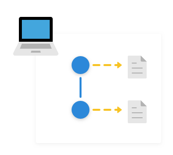
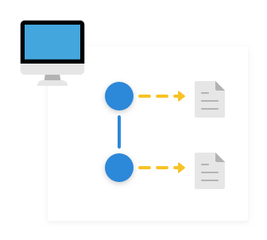
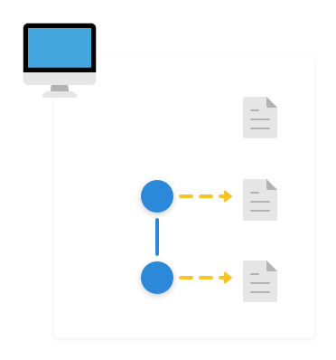
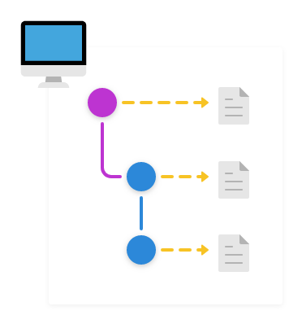
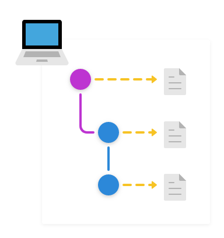
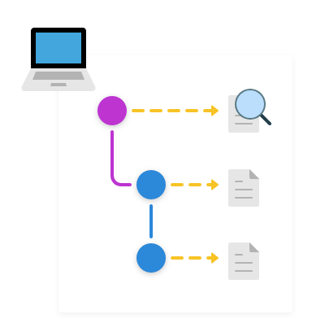
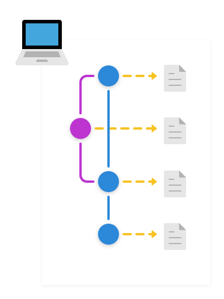

# Our first repo
```
git init git_tutorial
cd git_tutorial
```

---

# Our first file

```
echo 'hello world' > readme.txt
git status
```

---

# Our first commit

```
git add readme.txt
git status
git commit -m 'adds readme.txt'
git log
```

---

# We make a change

```
echo 'hello world!' > readme.txt
git status
```

---

# Our second commit

```
git add readme.txt
git status
git commit -m 'makes readme.txt louder'
git log
```

---

# Someone else comes along...

```
cd ..
git clone git_tutorial other_git_tutorial
cd other_git_tutorial
git log
git remote -v
```

---

# ... makes a change...

```
echo 'hello, world!' > readme.txt
git branch fix_punctuation
git checkout fix_punctuation
git status
```

---

# ... and commits

```
git add readme.txt
git status
git commit -m 'fixes readme.txt punctuation'
git log
```

---

# They push their branch to us

```
git remote -v
git push origin fix_punctuation
```

---

# We check their changes...

```
cd ../git_tutorial
git branch
git checkout fix_punctuation
git show
```

---

# ... 👍 and merge them into master

```
git checkout master
git merge fix_punctuation
git log
```

---

# Our first repo
```
git init git_tutorial
cd git_tutorial
```


---

# Our first file

```
echo 'hello world' > readme.txt
git status
```


---

# Our first commit

```
git add readme.txt
git status
git commit -m 'adds readme.txt'
git log
```


---

# We make a change

```
echo 'hello world!' > readme.txt
git status
```


---

# Our second commit

```
git add readme.txt
git status
git commit -m 'makes readme.txt louder'
git log
```



---

# Someone else comes along...

```
cd ..
git clone git_tutorial other_git_tutorial
cd other_git_tutorial
git log
git remote -v
```



---

# ... makes a change...

```
echo 'hello, world!' > readme.txt
git branch fix_punctuation
git checkout fix_punctuation
git status
```



---

# ... and commits

```
git add readme.txt
git status
git commit -m 'fixes readme.txt punctuation'
git log
```



---

# They push their branch to us

```
git remote -v
git push origin fix_punctuation
```



---

# We check their changes...

```
cd ../git_tutorial
git branch
git checkout fix_punctuation
git show
```



---

# ... 👍 and merge them into master

```
git checkout master
git merge fix_punctuation
git log
```


